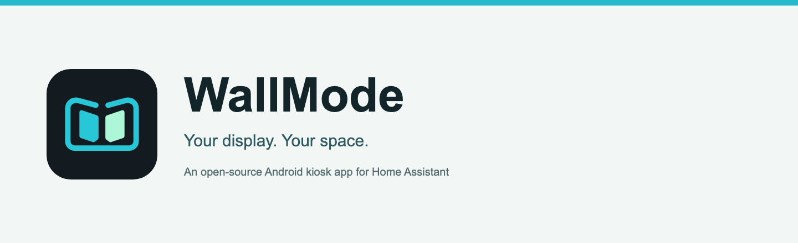
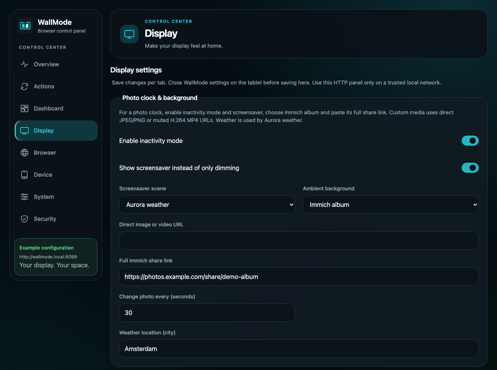
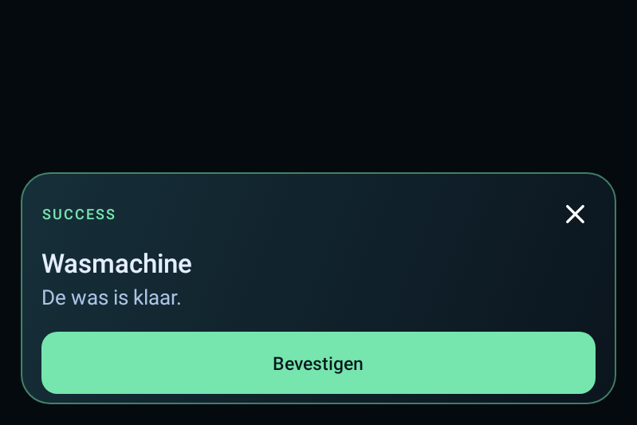

# WallMode: a free, open-source Android kiosk app for Home Assistant

Hi everyone,

I've been working on **WallMode**, an Android app for turning a tablet into a dedicated wall display. My main test device is a Lenovo ThinkSmart View, and I'd love to hear how it behaves on other tablets.

The idea is simple: keep your existing Home Assistant dashboard, give it a fullscreen home, and make the tablet useful even when you aren't touching it.

WallMode is a kiosk app, **not a replacement dashboard**. It opens your dashboard in Android's WebView and adds motion detection, screensavers, recovery tools and Home Assistant controls around it. Other web dashboards work too.

## What it can do

- **Fullscreen dashboard:** portrait or landscape, with optional start on boot.
- **Motion-aware idle timer:** with camera detection enabled, detected movement restarts the timer. When the room is quiet, the display can dim or show a screensaver; touch or detected movement brings the dashboard back.
- **Ambient display:** clock and weather scenes, custom image/video backgrounds, and an Immich album photo clock.
- **Home Assistant over MQTT:** device discovery, status information and controls for the display. MQTT is optional for basic dashboard use.
- **Notifications and temporary views:** show a message, a two-choice prompt, or temporarily open another view for a doorbell or other event. Home Assistant blueprints are included in the source tree.
- **Browser-based settings:** configure the tablet from a computer or phone on your trusted local network.
- **Recovery tools:** loading/error screens, retry options and an optional watchdog for a wall display that needs to keep running.

*The browser control panel, rendered with example settings. No personal dashboard or private album is shown.*

## A small example

A wall tablet can do more than sit on a dashboard. An automation can show a "laundry finished" notification with a confirmation button, then leave the dashboard available underneath. Temporary views and action prompts can be triggered from Home Assistant too.

*Native Android notification example. The message is in Dutch; notification text is supplied by your automation.*

## Trying it

**Source and documentation:** [GitHub - rvbcrs/WallMode](https://github.com/rvbcrs/WallMode)

**APK download:** [ADD SIGNED RELEASE DOWNLOAD LINK]

1. Install the APK on an Android 8.0+ device. Android may ask you to allow installation from the browser or file manager you used.
2. Open WallMode. To access settings, tap the top-right corner five times within 2.5 seconds.
3. Enter your dashboard URL under **Dashboard**, then choose **Save & open dashboard**.
4. Enable the screensaver and camera motion detection if you want them. Add your MQTT broker separately for the Home Assistant integration.

A working Android System WebView is required. Camera motion detection processes frames locally without recording them, but keeps the camera active while enabled and the app is in the foreground, so it uses extra power. The browser control panel is intended for a trusted LAN, not direct exposure to the internet.

## Early release: feedback welcome

This is still an early project. My main physical testing has been on the **ThinkSmart View**, so I can't promise identical behavior on every Android tablet. Camera behavior, WebView versions and manufacturer power management can differ.

If you try it, I'd especially appreciate:

- Your tablet model and Android version.
- Whether motion detection reliably keeps it awake and wakes the screensaver.
- Whether it recovers properly after a Wi-Fi interruption.
- Any layout issues or missing controls you notice.

WallMode is based on [KioskZen](https://github.com/exraaaa/KioskZen) and continues under the GPLv3 license. Thanks to the original project for the starting point.

**Which tablet would you try it on?**
